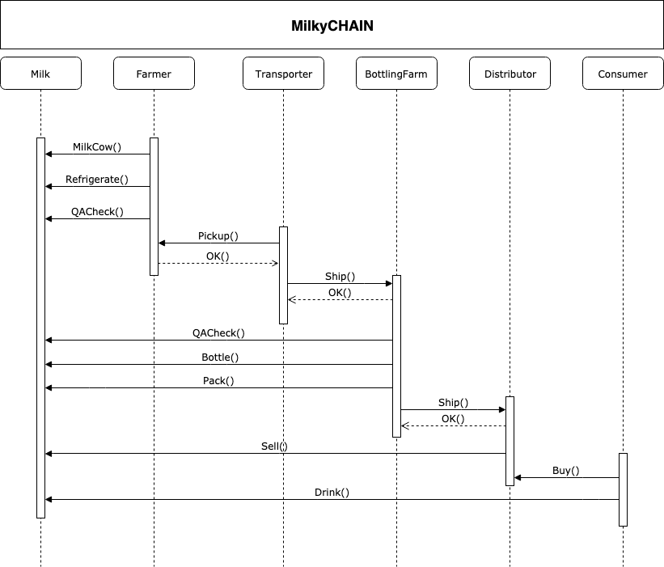
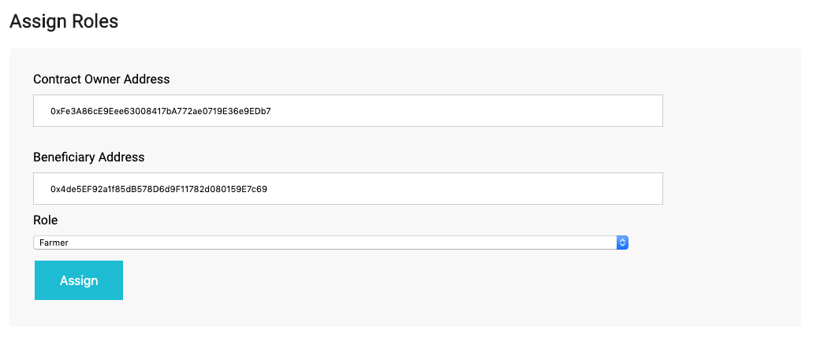
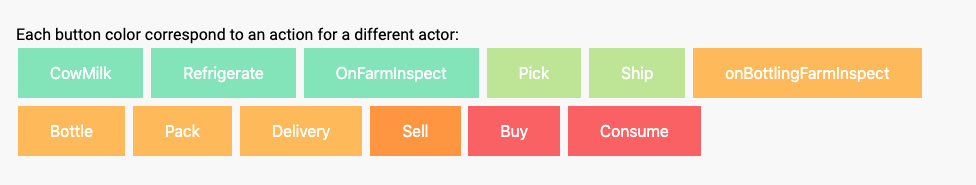
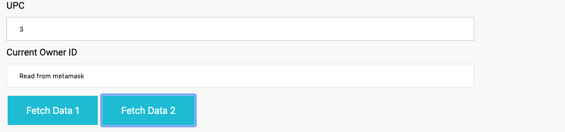
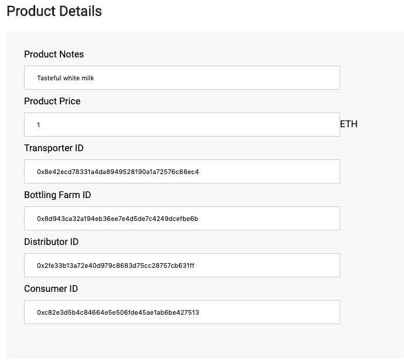

# MilkyCHAIN
The milk supply chain - Udacity nano degree project for Blockchain Architect


## Project write-up - UML
Project rubric https://review.udacity.com/#!/rubrics/1710/view


The project is intended to track the authenticity of the milk produced, from the cow to the bottle.

Here you find the supply chain workflow that has been implemented


Other diagrams are in /architecture folder.

## Project write-up - Libraries 
Following libraries has been used in this project:
*   Roles.sol : it allows managing addresses assigned to a Role (credit to Open-Zeppelin). 
*   Ownable.sol : it provides basic authorization control functions, this simplifies the implementation of "user permissions". (credit to Open-Zeppelin). 
*   Migrations.sol : it simplifies contract deployment (credit to Truffle). 

## Getting Started
These instructions will install requirements and allow you to execute the code.

Using:
- Truffle v4.1.15
- node v10.10.0


Install requirements 
```
npm install 
```

Please be aware that ganache-cli and truffle (version 4) has been used.


- To test the contract start ```ganache-cli``` and issue the command ```truffle test```.
All tests should pass.
``` 
$>truffle test
Using network 'development'.
ganache-cli accounts used here...
Contract Owner: accounts[0]  0xfe3a86ce9eee63008417ba772ae0719e36e9edb7
Farmer: accounts[1]  0x4de5ef92a1f85db578d6d9f11782d080159e7c69
Transporter: accounts[2]  0x8e42ecd78331a4da8949528190a1a72576c88ec4
BottlingFarm: accounts[3]  0x8d943ca32a194eb36ee7e4d5de7c4249dcefbe6b
Distributor: accounts[4]  0x2fe33b13a72e40d979c8683d75cc28757cb631ff
Consumer: accounts[5]  0xc82e3d5b4c84664e5e506fde45ae1ab6be427513


  Contract: SupplyChain
    ✓ 0. Deploy SupplyChain and Register Actors (268ms)
    ✓ Testing smart contract function milkCow() that allows a farmer to get milk (226ms)
    ✓ Testing smart contract function refrigerate() that allows a farmer to refrigerate milk (110ms)
    ✓ Testing smart contract function onFarmInspect() that allows a farmer to inspect milk (85ms)
    ✓ Testing smart contract function pick() that allows a trasponrter to get milk (130ms)
    ✓ Testing smart contract function ship() that allows a trasponrter to release milk (73ms)
    ✓ Testing smart contract function onBottlingFarmInspect() that allows bottling farm to inspect milk (122ms)
    ✓ Testing smart contract function bottle() that allows a bottling farm to bottle milk (74ms)
    ✓ Testing smart contract function pack() that allows a bottling farm to pack bottles (76ms)
    ✓ Testing smart contract function delivery() that allows a bottling farm to deliver packed bottles (77ms)
    ✓ Testing smart contract function sellItem() that allows distributor to sell milk (168ms)
    ✓ Testing smart contract function buy() that allows consumer to buy milk (1705ms)
    ✓ Testing smart contract function consumer() that allows a consumer to finally drink his milk! (74ms)

  13 passing (3s)

```
- To deploy the contract, with ganache-cli still running, issue the command ```truffle deploy```.
- Install Metamask plugin for chrome or firefox and connect it to ganache blockchain
- When your web app interacts with your wallet, Metamask will ask for confirmation. 
**Please note that all the smart contract methods are invoked by the current wallet selected in Metamask**

## UI 
You can interact with the smart contract by running the user interface (ganache-cli shoul always be running)
- To start the interface
```
npm run dev
```
- open a Chrome browser instance with Metamask configured
- To assign roles, set the addresses and the role to assign:

- To run supplychain commands, set the upc value, then hit the command choiching the right wallet address in MetaMask. Every button color correspond to a different role:


- To retriew the authenticity of the milk and gather its informations, fill the UPC, hit "Fetch Data 2" and see the form:



- All other infos (like errors) are logged in browser console
- Transaction history is on the bottom of the page


## Deployed Contract on RINKEBY
*   Contract ID : 0x84E8edF4072165f86EF729B21E55656Bfdea1f91
*   Transaction ID:  0x45b106f553e9e94326b8cf842253dd506c913129f315fbe0c94f45be65d0af82
*   Etherscan view: https://rinkeby.etherscan.io/address/0x84e8edf4072165f86ef729b21e55656bfdea1f91#code


